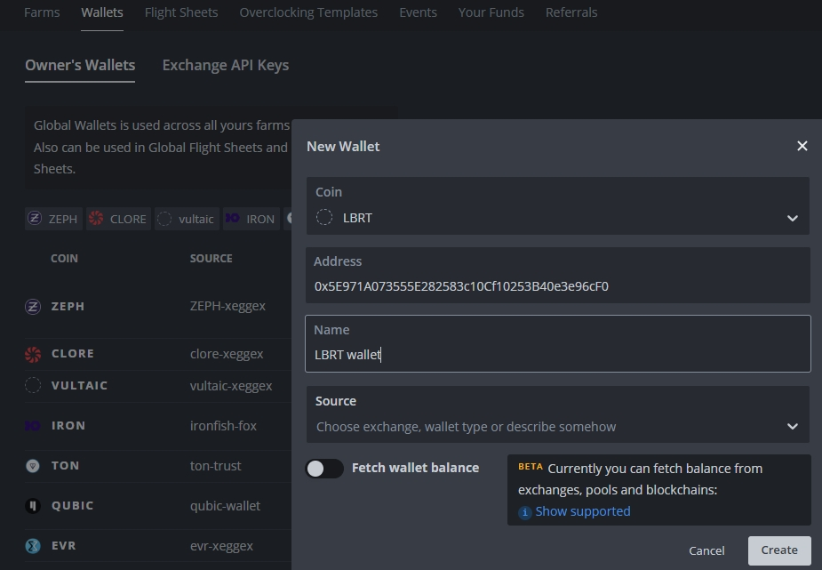
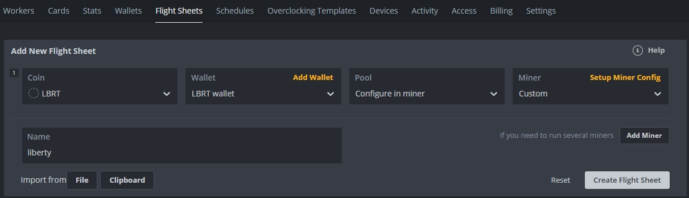
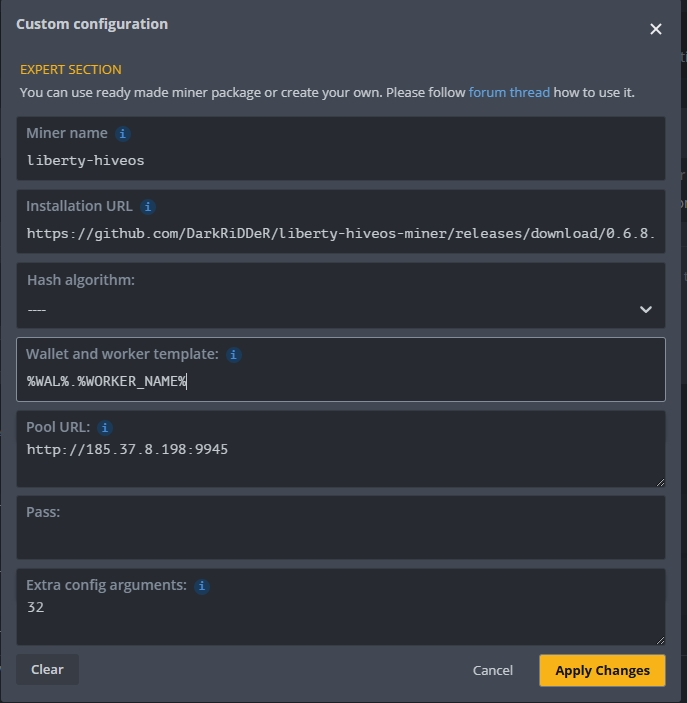

# [Libertyproject.space](https://libertyproject.space/) - Hive OS client

This is the integration of the client from [Liberty-CPU-miner](https://github.com/LibertyProject-chain/Liberty-CPU-miner) into HiveOS.

*Hive OS does not support the installation of two custom miners.*

## Welcome to [Liberty](https://libertyproject.space/)

- Decentralized digital network, where every service is a vital part of our integrated ecosystem.
- The Liberty Project is dedicated to creating high-performance solutions driven by our proprietary coin, designed to unlock tangible value for our users.
- With a focus on utility and community needs, our team is paving the way step by step for a more convenient digital future.

# Install

## New wallet

Coin (create new): ``LBRT``

Address: ``your LBRT address``

Name: ``LBRT wallet``

## Flight Sheet

Coin: ``LBRT``

Wallet: ``LBRT wallet``

Pool: ``Configure in miner``

Miner: ``Custom``

## Custom miner config

Miner name: ``lyberty-hiveos``

Installation URL: ``https://github.com/DarkRiDDeR/liberty-hiveos-miner/releases/download/0.6.8.0/liberty-hiveos-0.6.8.0.tar.gz``

Hash algorithm: ``---``

Wallet and worker template: ``%WAL%.%WORKER_NAME%``

Pool URL: ``your node address``

Extra config arguments (threads): ``32``

# Donations

LBRT: `0x5E971A073555E282583c10Cf10253B40e3e96cF0`

# Code examples

https://github.com/minershive/hiveos-linux/tree/master/hive/miners/custom

https://github.com/HaloGenius/hiveos-custom-miner/

https://github.com/MoneroOcean/hiveos/tree/main/mo_xmrig

# License

MIT License